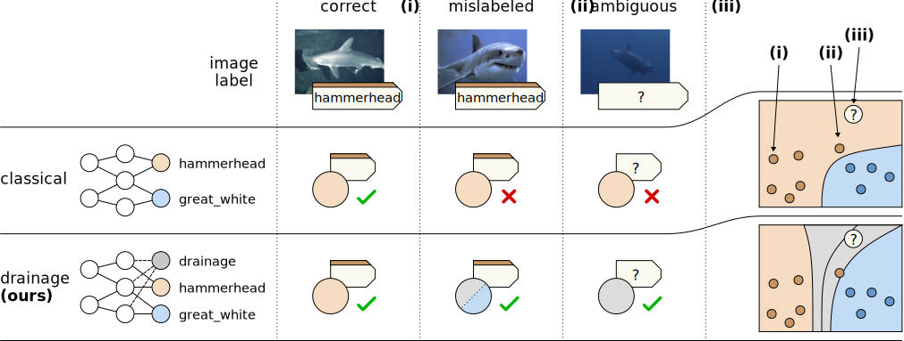

# Drainage
## Overview
Modern deep learning struggles with noisy labels, class ambiguity, and reliably rejecting out-of-distribution or corrupted samples. We introduce a [unified framework](https://arxiv.org/abs/2512.03182v1) that adds a “drainage node” to the network output. Through a dedicated "drainage loss", the model reallocates probability mass toward uncertainty while preserving end-to-end training and differentiability. This provides a natural outlet for highly ambiguous, anomalous, or noisy samples, especially under instance-dependent and asymmetric label noise. A depiction of the Drainage is shown in Figure 1 contrasting it to classical methods in case of mislabeled or ambiguously labeled samples.

<p align="center">
  
  <br>
  <em>Figure 1: Different sources of class uncertainty, and the way they are handled by a classical classification model (e.g.\ softmax / cross-entropy) and by our proposed drainage model. Our drainage-based approach is more robust to mislabelings, and allows ambiguous and outlier instances to be predicted as `drainage' rather than classified arbitrarily.</em>
</p>

The drainage loss is presented as:

$$
\ell(p,t) = \log\Big(1 + \alpha\Big(\frac{p_d}{p_t} + \frac{p_\mathcal{J}}{p_t}\Big) + \beta \frac{p_\mathcal{J}}{p_d}\Big)
$$

Here $$p_t$$ and $$p_d$$ denote the probability mass assigned by the model to the target class and the drainage node, respectively, while $$p_\mathcal{J}$$ represents the probabilities of all off-target classes. The hyperparameters $$\alpha,\beta > 0$$ control the openness of the drainage.

## Scope
We view our contribution as a general, practical advancement with potential impact across multiple areas of machine learning. For clarity and focus, this project presents the method primarily through the lens of robust loss design. This codebase provides tools for evaluating robust loss functions across a range of datasets. It includes clean datasets such as MNIST, CIFAR-10, CIFAR-100, and ILSVRC12, as well as datasets with real-world label noise, including CIFAR10-N (40.2%), CIFAR100-N(40.2%), WebVision (20%), and Clothing1M (38.5%). It also supports adding synthetic noise to MNIST, CIFAR-10, and CIFAR-100. Among the synthetic options, asymmetric noise and instance-dependent noise most closely resemble real-world label corruption, and can be used to systematically distort labels in these datasets.

## Requirements

```console
python >= 3.9, torch >= 1.12.1, torchvision >= 0.13.1, numpy >= 1.23.1
```

## Usage

### Configs

- Check '*.json' file in the config folder for each exeriment.
- update DATA_DIR in main.pyto point to cifar-10, cifar-100
- update CIFAR10_HUMAN_NOISE_PATH and CIFAR100_HUMAN_NOISE_PATH in dataset.py to point to human-annotated noise files.
- update webvision configs: train_data_path and val_data_path to point to webvisoin train and validation set folders.
   - The val_data_path could also point to ILSVRC2012 validation set folder for evaluation.
-update all clothing1m configs: data_path to point to clothing1m dataset folder.

### Arguments

* gpu: GPU id
* seed: random seed
* config: config name
* noise_type: 'asym' if use asymmetric noise, 'instance' if use instance-dependent noise, 'human' if use human-annotated noise. if human, noise_rate is ignored.
* noise_rate: noise rate; between 0 and 1
* eval_freq: frequency of evaluation, default is 1
* tuning: use the tuning settings (80% of the original training set as training set and 20% as validation set)

### Example

Training Alpha DL on CIFAR-10 with 0.8 symmetric noise:
```bash
python main.py \
--gpu 0 \
--seed 1 \
--config cifar10_alpha_dl \ 
--noise_type asym \
--noise_rate 0.45 \
--eval_freq 10
```
## Reference
If you find this work helpful, please consider citing our paper:
```
@misc{taha2025drainageunifyingframeworkaddressing,
      title={Drainage: A Unifying Framework for Addressing Class Uncertainty}, 
      author={Yasser Taha and Grégoire Montavon and Nils Körber},
      year={2025},
      eprint={2512.03182},
      archivePrefix={arXiv},
      primaryClass={cs.CV},
      url={https://arxiv.org/abs/2512.03182}, 
}
```
## Thanks

Moreover, parts of this repository is taken from [Ye et al.](https://github.com/Virusdoll/Active-Negative-Loss), [Ma et al.](https://github.com/HanxunH/Active-Passive-Losses) and [Zhou et al.](https://github.com/hitcszx/ALFs).
